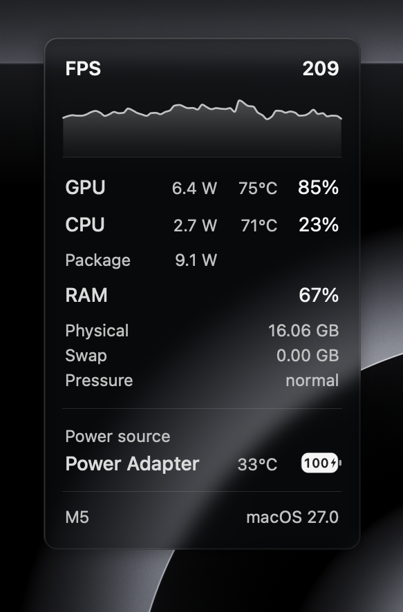
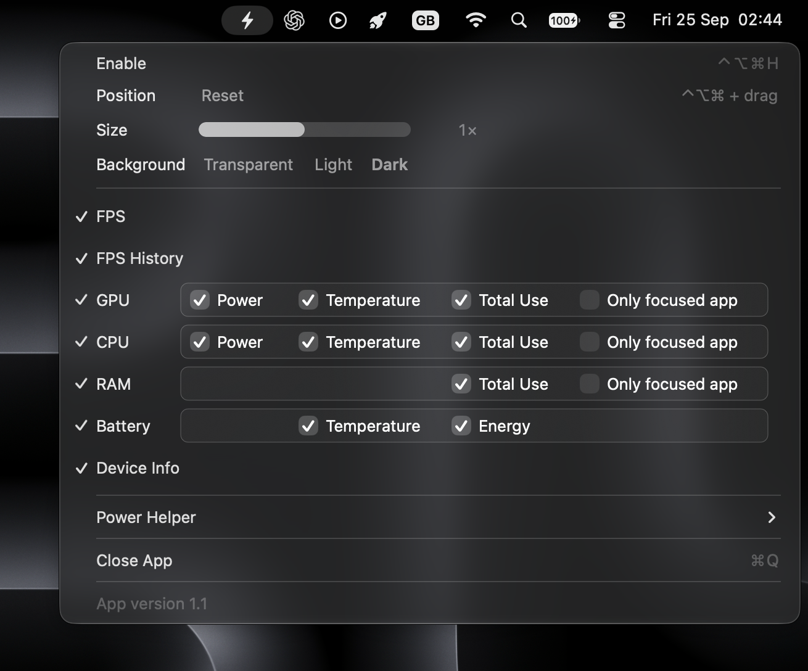

# PerformanceHUD

## ↓ Download options

Source is available to build and modify for personal use under the [personal-use license](LICENSE). You can build it yourself for free using the [installation instructions](INSTALL.md).

****[Download on Gumroad](https://unturneded.gumroad.com/l/PerformanceHUD)** — Get the ready-built app for a one-time $3.99 to support me and the development time that has gone into it. It offers the same features as the version you build yourself. No subscription or feature unlocks.

****GitHub sponsorships — pending approval.** If you prefer to build the app yourself but would still like to support its development, optional sponsorships will offer another way to contribute. A link will be added once approved.

## What is this?

PerformanceHUD is a macOS menu-bar app that keeps useful performance information visible over your game or app. Values shown are customizable and can be toggled on and off, and the HUD can be repositioned and resized on screen.

[Watch PerformanceHUD used in a game on YouTube](https://youtu.be/KWYLW9O11SU?si=knZWxHzDuP24ZpmE)

- FPS for supported apps and games, and FPS history graph showing trends over the last 60 seconds.
- Mac resources usage, such as GPU CPU and RAM, for just the app or the whole system.
- Estimated CPU and GPU temperatures on supported hardware.
- Battery percentage.
- Device information such as chip name and macOS version.

## Compared with Apple's Metal performance HUD

This is not aimed to be a MetalHUD replacement, Apple's built-in Metal HUD focuses on deep graphics diagnostics and debugging. PerformanceHUD focuses on showing a simpler overview of used system resources, similar to MSI Afterburner overlays on Windows.

### Advantages

- Tiny, purpose-built app without unnecessary extras or bundled bloatware—approximately just 2 MB for the app.
- Can be enabled any time without re-opening the game.
- App and system resource readings alongside FPS, plus swap, memory pressure, and battery.
- Configurable layout with individual metric toggles, adjustable size, position and keyboard shortcuts.
- HUD resolution stays rendered at sharp retina resolution even if the game is set to a low resolution.

### Tradeoffs

- No frame-time graphs or detailed Metal rendering diagnostics.
- Most metrics refresh approximately once per second. Battery updates less frequently, and the glass background refreshes independently. In practice the notable downside is that FPS is limited to updating slightly slower than metalHUD.
- FPS and app GPU readings depend on the game and the counters macOS exposes; unsupported readings remain blank. It should however work for any game that metalHUD also can, such as most Crossover games, Steam games, Minecraft (using Vulkan render), etc.
- Per-app readings cover the tracked process and may exclude helper processes. Values can differ from Activity Monitor.
- Designed for borderless and windowed games. Exclusive fullscreen support is unlikely to work for most game although some may still work; expect the HUD not to appear in that mode as it cannot render on top.
- Sampling, calculating and rendering data add performance overhead. In my testing, enabling PerformanceHUD in-game reduced FPS by around 4–8%. The impact varies by game, hardware, and settings.

## Technical details on what it accesses

FPS comes from Apple's macOS metalperftrace tool. CPU and app memory readings use macOS process statistics; GPU readings use IOKit GPU counters. System memory, swap, memory pressure, and battery readings come from macOS system statistics and power information. PerformanceHUD reads these measurements without modifying game files or injecting code into games.

ScreenCaptureKit is required to capture the area behind the HUD to display the transparent overlay on top, pixels are processed locally and captured frames stay in memory and are not saved as recordings or uploaded. This requires granting Screen Capture permission.

## Requirements

- Apple silicon Mac (M-series), running macOS 27.0 or later.
- Screen Capture permission.

Metal HUD reference: [Apple Metal developer tools](https://developer.apple.com/metal/tools/).

## License

Source available for private, personal, non-commercial use. You may build and modify the app for yourself. Redistribution of compiled copies, whether free or paid, and resale are prohibited without prior written permission. The official paid download has the same personal-use restrictions. See [LICENSE](LICENSE) for the full terms.
