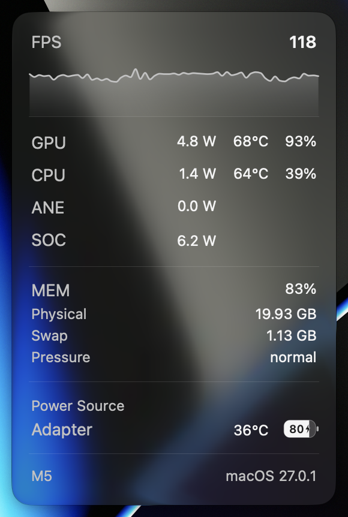
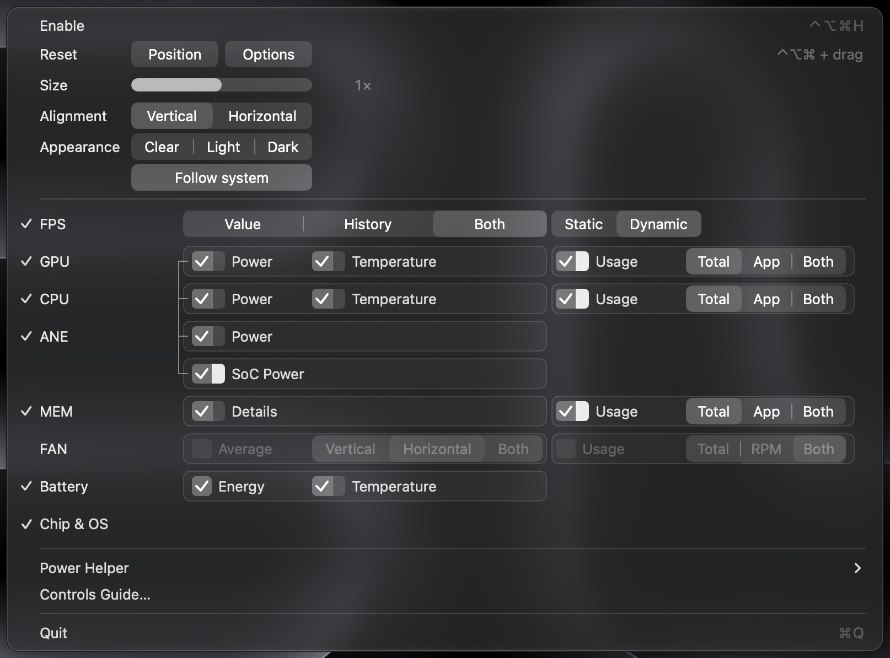
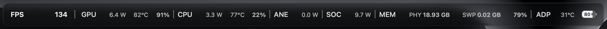
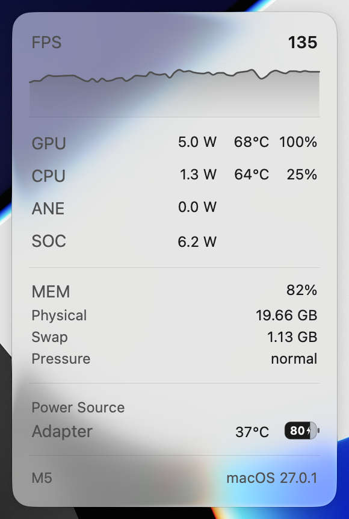
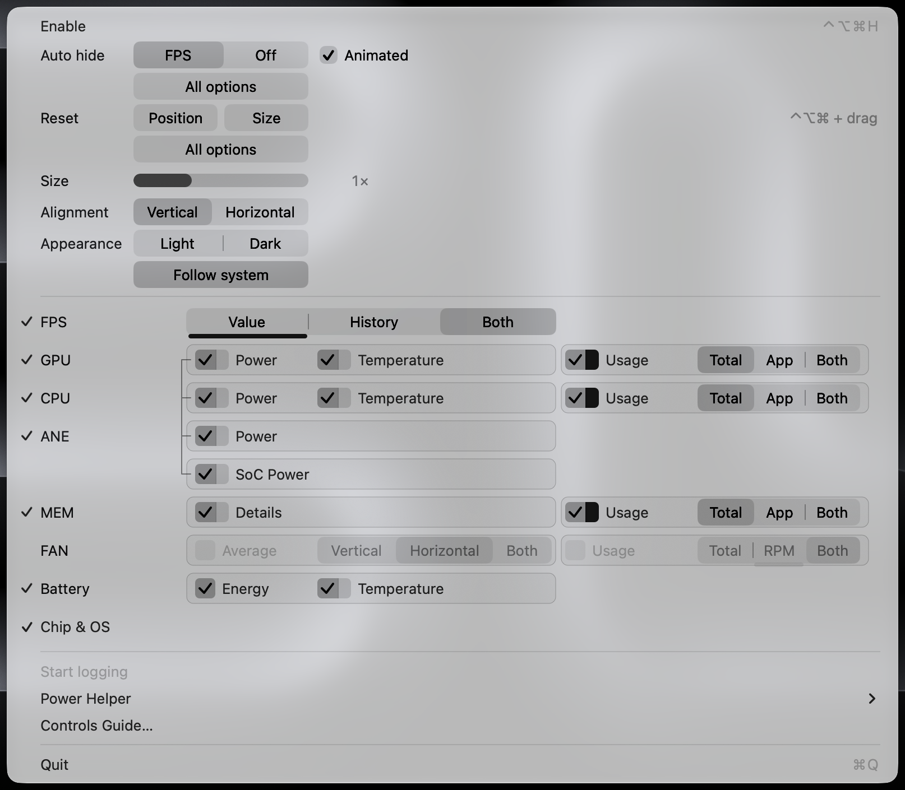
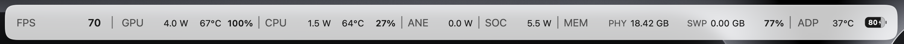

# PerformanceHUD

## ↓ Download options &nbsp;

Download the ready-built app for **$3.99**, or build it yourself for free. Both offer the same features, with no subscription or feature unlocks.

  &nbsp;
  

Purchases encourage maintenance of PerformanceHUD. The paid app can be used personally or commercially, including in monetized videos and streams. Free source builds and modifications are for **personal, non-commercial use**. Resale and external redistribution are not permitted. See the [license](LICENSE) for details.

If you prefer to build the app yourself but would still like to support it, **GitHub Sponsorships** will offer another way to contribute, it will be added later.

## ✦ About PerformanceHUD

<table>
<tr>
<td>

<strong>Take a closer look — features, screenshots &amp; controls</strong>

PerformanceHUD is a small app under 10 MB that displays a customizable performance overlay over games and apps. It's a highly versatile tool,  you can use it while gaming, show performance and system information for benchmark videos, or record readings to CSV for later analysis. It can display FPS, CPU, GPU and memory statistics, fan speeds, battery information, and details about the focused app.

The default layout offers a balanced selection of useful metrics, but the overlay is designed to be highly configurable. You can choose which readings to show, emphasize key values, switch layouts, and select different display styles where supported. Show all the stats available at all times, or use it as a small unobtrusive FPS-only overlay that can automatically hide itself when out of the game. My priority has been to make useful information easy to read without distracting from what’s behind it.

All settings are available directly in the menu bar. You can show or hide the HUD at any time, including while a game is running. Editable hotkeys let you toggle the HUD, start or stop logging, and change appearance without leaving your current app. The built-in Controls guide explains each option and how it works. In-app updates, optional weekly or monthly update checks, and optional startup at login are also available from the menu.

I’ve put a lot of thought into keeping the overlay readable and the controls organized as more features have been added. The goal is to make a useful, thoughtfully designed tool that i would actually want to use myself.

<table>
  <tr>
    <th colspan="2">Dark appearance</th>
  </tr>
  <tr>
    <td width="33%" valign="top" align="center">
       
      Vertical HUD
    </td>
    <td width="67%" valign="top" align="center">
       
      Menu controls
    </td>
  </tr>
  <tr>
    <td colspan="2" align="center">
       
      Horizontal HUD
    </td>
  </tr>
</table>

<table>
  <tr>
    <th colspan="2">Light appearance</th>
  </tr>
  <tr>
    <td width="33%" valign="top" align="center">
       
      Vertical HUD
    </td>
    <td width="67%" valign="top" align="center">
       
      Menu controls
    </td>
  </tr>
  <tr>
    <td colspan="2" align="center">
       
      Horizontal HUD
    </td>
  </tr>
</table>

*Liquid Glass follows macOS by default; its strength can also be adjusted in the app.*

See PerformanceHUD in-game example (video from an older version of the app)

</td>
</tr>
</table>

 

## Display compatibility

View display modes and fullscreen compatibility

- **Windowed and borderless:** Recommended display mode for games and apps for universal compatibility and "just works". The HUD stays visible over apps and games, with correct scaling and Retina rendering independent of the game’s rendering resolution.
- **Fullscreen — native macOS games:** Generally works in fullscreen mode. Some games change macOS UI scaling in fullscreen exclusive, making the HUD and other system UI appear smaller or larger. The HUD follows macOS scaling; so if for example a game is set to 4K macOS scale may become a lot smaller including the HUD, in such cases adjusting the **Size** in the PerformanceHUD menu between **0.5× to 2×** can make it fit better. Confirmed working in fullscreen exclusive in Stray and Minecraft using Vulkan rendering.
- **Fullscreen — Windows games through compatibility layers:** Games running through CrossOver or similar tools only show the HUD reliably when the fullscreen resolution matches your desktop’s current “looks like” resolution or its 2× Retina equivalent. Confirmed working with matching resolutions in Red Dead Redemption 2 and Resident Evil Requiem through CrossOver. If the HUD disappears, try one of these resolutions or switch to windowed/borderless.

To find your desktop resolution, open **System Settings → Displays** and hover over the selected scaling thumbnail, or choose **Show List**. For the 2× Retina equivalent, double both dimensions. For example, a 13-inch MacBook Air uses **1470×956** or **2940×1912** with its default scaling setting. So for the HUD to be visible in RDR2 running through CrossOver while the game is set to fullscreen the in-game resolution would need to be set to either **1470x956** or **2940x1912**. Windowed and borderless mode avoids needing matching resolutions as mentioned.

## Requirements

View system requirements

- Apple silicon Mac (M-series), running macOS 27.0 or later.

## More resources

- [Differences between PerformanceHUD and MetalHUD](docs/METAL_HUD_COMPARISON.md)
- [Bugs & suggestions](docs/FEEDBACK.md)
- [Changelog](docs/CHANGELOG.md)
- [Privacy & access](docs/PRIVACY_AND_ACCESS.md)
- [License](LICENSE)
